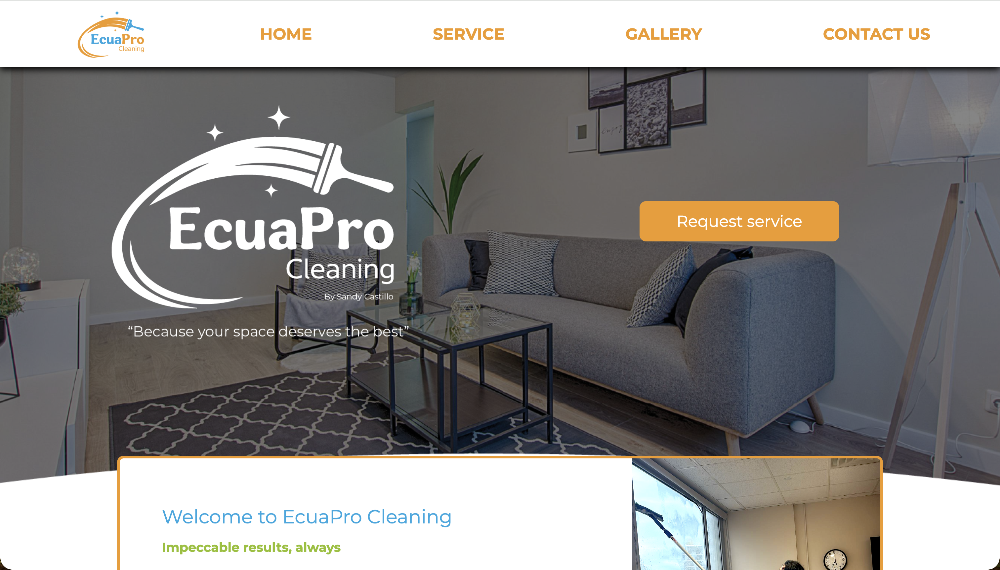
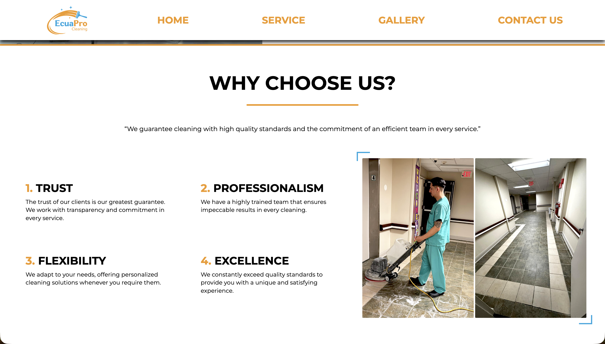
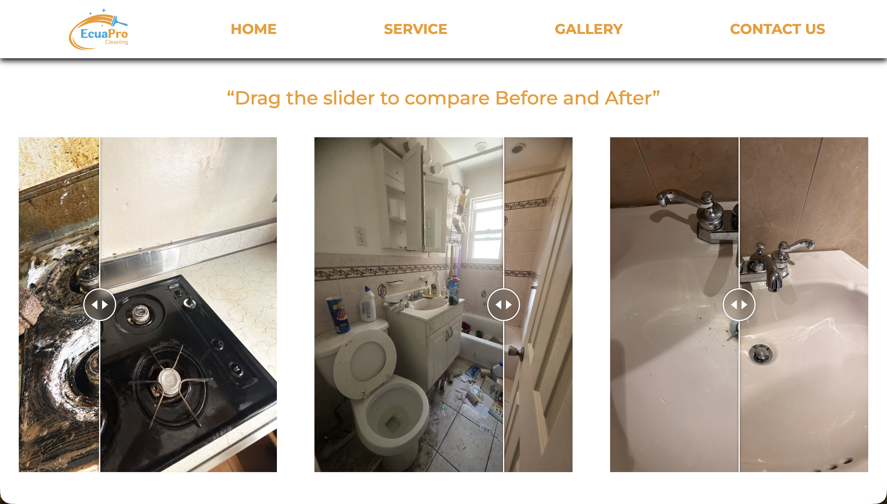
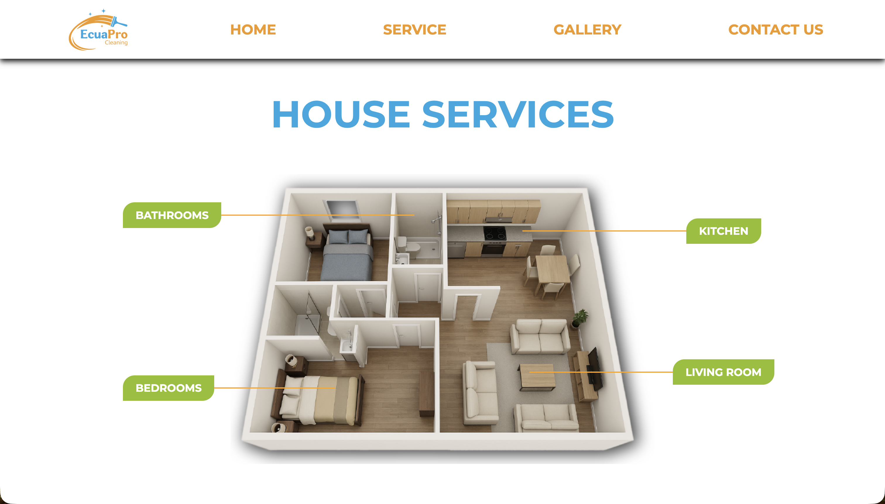
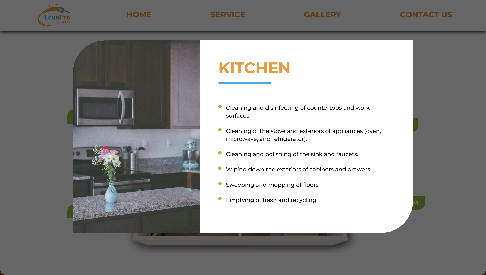

# EcuaPro

Production: [ecua-pro.vercel.app](https://ecua-pro.vercel.app/)

EcuaPro is a professional cleaning services website built to promote residential and office cleaning solutions through a modern, visual, and responsive experience.

The project focuses on clear service presentation, before-and-after proof of work, and direct contact options that help potential clients quickly understand the value of the service and reach out with minimal friction.

## Overview

EcuaPro was designed around three main goals:

- present cleaning services in a clear and professional way
- demonstrate service quality through visual comparisons
- make customer contact fast and accessible

Rather than acting as a generic landing page, the project organizes services, gallery content, and contact flows into a structured browsing experience for both residential and business customers.

## Main Features

- Professional landing page for a cleaning services brand
- Dedicated service catalog for home and office cleaning
- Interactive service detail modals
- Before-and-after cleaning showcase
- Dedicated gallery page with transformation examples
- Direct WhatsApp contact flow
- Direct email contact flow
- Responsive design for desktop, tablet, and mobile

## Tech Stack

### Frontend

- React 19
- Vite
- React Router DOM
- Lucide React
- React Icons
- React Compare Slider
- React Compare Image
- React Before After Slider Component

### Development Tools

- ESLint

## Project Structure

```text
src
├── assets              # Images, logos, 3D visuals, and before/after photos
├── components
│   ├── contact         # Contact forms and communication flows
│   ├── gallery         # Gallery presentation
│   ├── home            # Landing page sections
│   ├── layout          # Header, footer, layout, scroll behavior
│   └── services        # Service listing and modal details
├── App.jsx             # Route configuration
├── App.css             # Global app styles
└── main.jsx            # App entry point
```

## Main Pages

- `Home`: brand introduction, service highlights, and before/after section
- `Services`: categorized cleaning services for homes and offices
- `Gallery`: real examples of cleaning transformations
- `Contact`: direct customer communication through WhatsApp and email

## Service Areas Covered

The project presents cleaning services such as:

- Bathrooms
- Bedrooms
- Kitchens
- Living rooms
- Workstations
- Floors and windows
- Meeting areas
- Common areas

This structure makes the offer easier to understand for both household and commercial clients.

## Contact Flows

EcuaPro includes two simple customer contact options:

- WhatsApp message generation
- Email message generation

These flows are handled directly from the frontend, making the site lightweight and easy to deploy while still giving users immediate ways to reach the business.

## Screenshots

### Home





### Before and After Comparison



### Services





## Local Development

### 1. Clone the repository

```bash
git clone https://github.com/Ypz22/EcuaPro.git
cd EcuaPro
```

### 2. Install dependencies

```bash
npm install
```

### 3. Start the development server

```bash
npm run dev
```

### 4. Build for production

```bash
npm run build
```

### 5. Preview the production build

```bash
npm run preview
```

## Available Scripts

```bash
npm run dev      # Start development server
npm run build    # Build production version
npm run preview  # Preview production build
npm run lint     # Run ESLint
```

## Why This Project Matters

EcuaPro stands out because it combines:

- service-focused business presentation
- strong visual proof through before-and-after content
- clear navigation between marketing sections
- fast direct-contact flows without unnecessary complexity
- a responsive structure suitable for real customer use

## Possible Future Improvements

- Online booking system for cleaning services
- Quote request workflow
- Customer dashboard
- Service scheduling automation
- Deeper SEO and analytics integration

## Author

Jefferson Yepez

## License

Private project.
