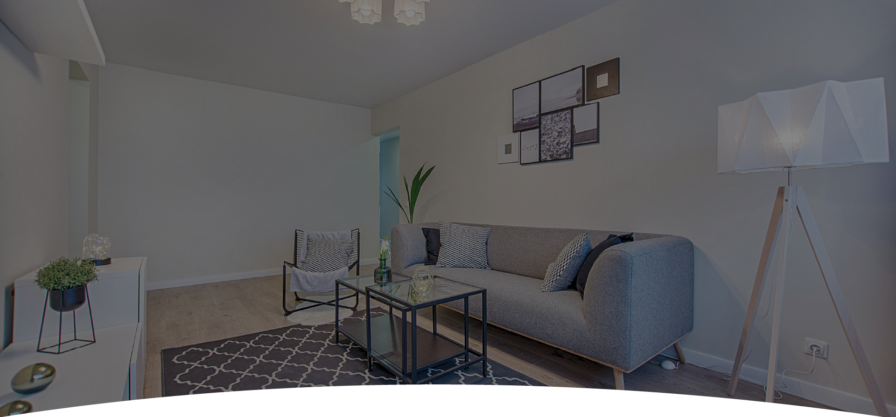
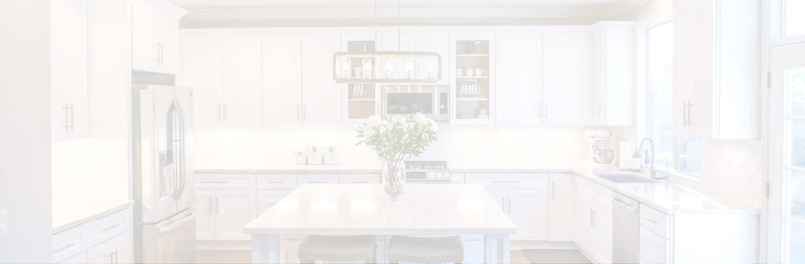
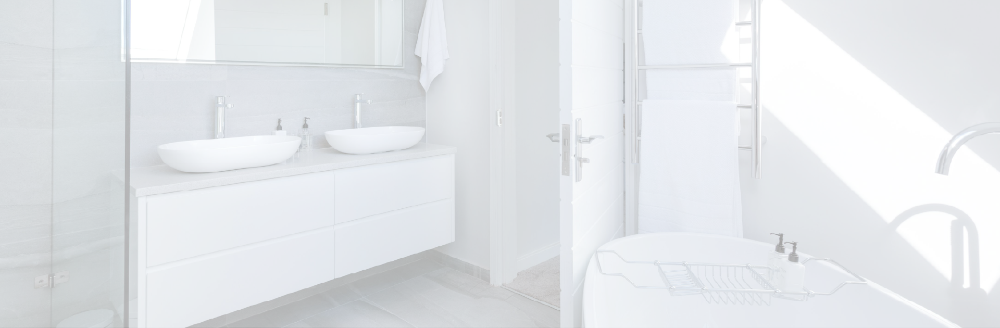

# EcuaPro

EcuaPro is a professional web platform designed for the promotion and management of residential and commercial cleaning services. The application provides a visually rich user experience that allows visitors to explore services, view before-and-after transformations, and easily contact the professional cleaning team.

The platform focuses on presenting services in a modern, elegant, and responsive interface that works seamlessly across devices.

---

## Technologies Used

### Frontend

- React 18  
Modern JavaScript library used to build a modular and reactive user interface.

- Vite  
Next-generation build tool that provides extremely fast development and optimized production builds.

- Modular Components  
Architecture based on reusable components for sections such as Hero, Gallery, Services, and Contact.

- Modern CSS  
Responsive and visually polished design ensuring smooth navigation across desktop, tablet, and mobile devices.

---

## Development Tools

- ESLint  
Strict configuration used to maintain code quality, consistency, and best practices across the project.

---

## Application Gallery

Below are some of the key sections that showcase the main features of the platform.

### Home Page (Hero Section)

The main landing section provides a strong first impression with high-quality visuals and a clear service presentation.

Image location:



---

### Before and After Comparison

One of the most powerful features of the platform, demonstrating the effectiveness of the cleaning services through visual comparisons.

Image location:


---

### Services Catalog

Detailed presentation of service categories such as:

- Common Areas
- Kitchen Cleaning
- Bedroom Cleaning
- Bathroom Cleaning

Image location:



---

### Projects Gallery

A visual portfolio showcasing completed cleaning projects and transformations.

Image location:



---

## Project Structure
```
src/
├── assets/
│   └── images, logos, and before/after cleaning photos
│
├── components/
│   └── page sections (Hero, Who, Services, Contact, etc.)
│
│   ├── layout/
│   │   └── structural elements (Header, Footer, ScrollTop)
│   │
│   ├── home/
│   │   └── landing page logic and sections
│   │
│   └── gallery/
│       └── project visualization components
│
├── App.jsx
│   └── main application component
│
└── main.jsx
    └── application entry point and React rendering
```

---

## Installation

Clone the repository

git clone https://github.com/your-username/ecuapro.git
cd ecuapro

Install dependencies

npm install

Start development server

npm run dev

Build production version

npm run build

---

## Future Improvements

- Online booking system for cleaning services
- Customer dashboard
- Payment integration
- Automated service scheduling
- SEO optimization

---

## License

This project is the property of EcuaPro. Any reproduction, distribution, or modification without prior authorization is strictly prohibited.
